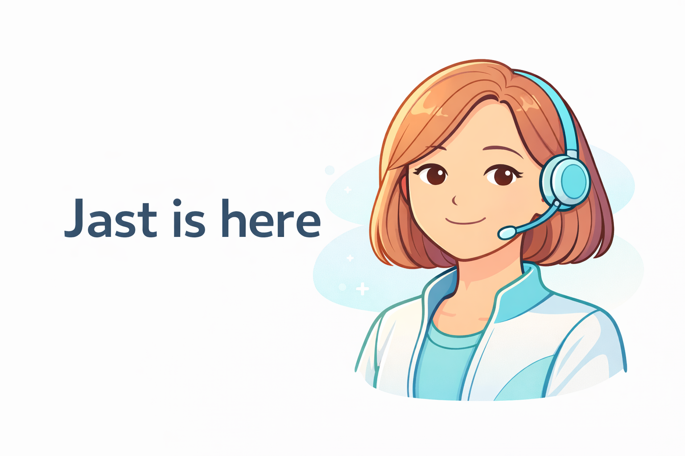

# JAST – Your Personal Wellbeing Assistant

JAST keeps you focused, organized, and kind to yourself. It pairs a calming interface with practical tools like focus timers, quick actions, task lists, brain dumps, and end-of-day reflections. Data stays in your browser by default—no account required.

## Features
- Friendly onboarding that greets you by name and can be reopened anytime
- Focus timer with a dreamy overlay for deep work
- Quick actions to kickstart tasks without friction
- Task list + brain dump to capture and organize everything
- End-of-day reflection to close loops and celebrate wins
- Light/dark theming, responsive layout, and smooth micro-animations

## Requirements
- Node.js 18+ (recommend using [nvm](https://github.com/nvm-sh/nvm))
- npm 9+ (ships with Node)

## Setup
```sh
git clone <your_repo_url>
cd <your_project_folder>
npm install
npm run dev
```

Open http://localhost:5173 (or the port Vite reports) to start using JAST.

## Scripts
- `npm run dev` — start the Vite dev server
- `npm run build` — production build to `dist/`
- `npm run preview` — preview the production build locally
- `npm run lint` — lint the codebase

## Deployment
1. Build: `npm run build`
2. Serve the `dist/` directory with any static host (Netlify, Vercel, GitHub Pages, S3, etc.).


## Want to support JAST?
If JAST helps you stay on track, consider buying a coffee: 
https://www.buymeacoffee.com/jastapp
https://paypal.me/alixocracy

## Any feedbak?
https://forms.gle/S3HMEF9UShV4PQoW9


<p>
  <a href="https://www.buymeacoffee.com/jastapp" title="Buy me a coffee" target="_blank" rel="noreferrer">
    
  </a>
  <a href="https://paypal.me/alixocracy" title="Donate via PayPal" target="_blank" rel="noreferrer" style="margin-left:8px;">
    
  </a>
  <a href="https://forms.gle/S3HMEF9UShV4PQoW9" title="Share feedback" target="_blank" rel="noreferrer" style="margin-left:8px;">
    
  </a>
</p>
